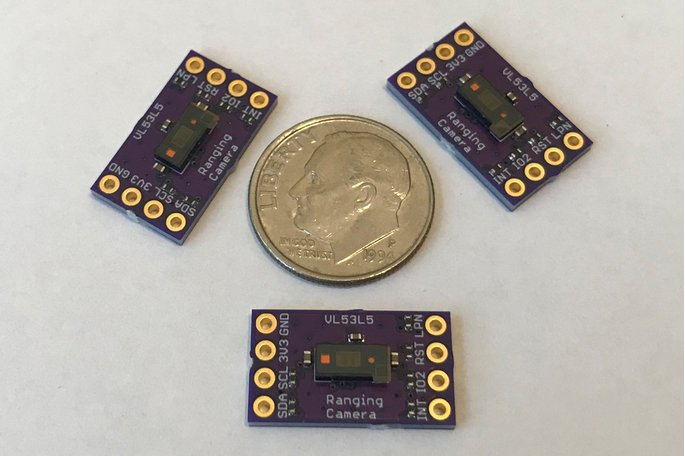

<b>NOTE: I am no longer maintaining this repository, having found more recent libraries for the VL53L5CX sensor</b>

* [SparkFun VL53L5CX Arduino Library](https://github.com/sparkfun/SparkFun_VL53L5CX_Arduino_Library)

* [STM32DUINO VL53L5CX Library](https://github.com/stm32duino/VL53L5CX)
